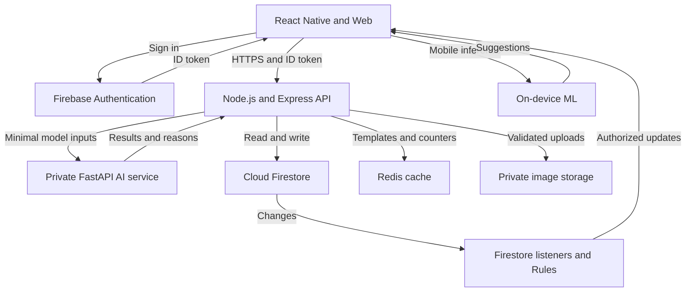

# FitFlow Architecture

## Overview

The frontend uses Firebase Authentication for identity.
Protected writes pass through the Express API.
Authorized clients receive community updates through Firestore listeners.

## Architecture Diagram

A separate image version is available in architecture.png.

## Personalized Workout Flow

1. The user submits goals, available time and equipment.
2. The API verifies identity and record ownership.
3. The AI service receives only necessary features.
4. The service returns exercises, reasons and a model version.
5. The user accepts or adjusts the suggestion.
6. The API saves the approved plan.
7. The frontend caches it for offline access.

A curated fallback is available when inference fails.

## Private Social Sharing Flow

1. The user selects a summary and a private circle.
2. The API checks current circle membership.
3. The API saves the authorized post.
4. Firestore listeners deliver updates to permitted members.

Detailed health records are not automatically shared.
The interface displays "Private - invite only".

## Nutrition Tracking Flow

1. The user selects "Log Meal".
2. Mobile inference suggests food labels and confidence values.
3. The user confirms the food and portion.
4. A nutrient data source provides estimated nutrition values.
5. The API validates and saves the confirmed meal.

Manual logging remains available when recognition fails.
Cloud image processing requires explicit consent.
Original photos are not retained by default.

## Offline Synchronization

The client keeps an application outbox for pending API writes.
Each workout event has a unique identifier.
The server deduplicates repeated submissions.

Firestore offline support does not automatically queue
requests to the Express API.

## Security and Scalability

- Verify tokens and enforce resource authorization.
- Apply default-deny Firestore Security Rules.
- Protect AI endpoints with service-to-service authentication.
- Keep server credentials outside client applications.
- Use private image storage and a retention policy.
- Paginate queries and limit real-time subscriptions.
- Scale API and AI services independently.
- Use Redis only when shared caching or counters are needed.
- Monitor database usage, inference costs and request failures.